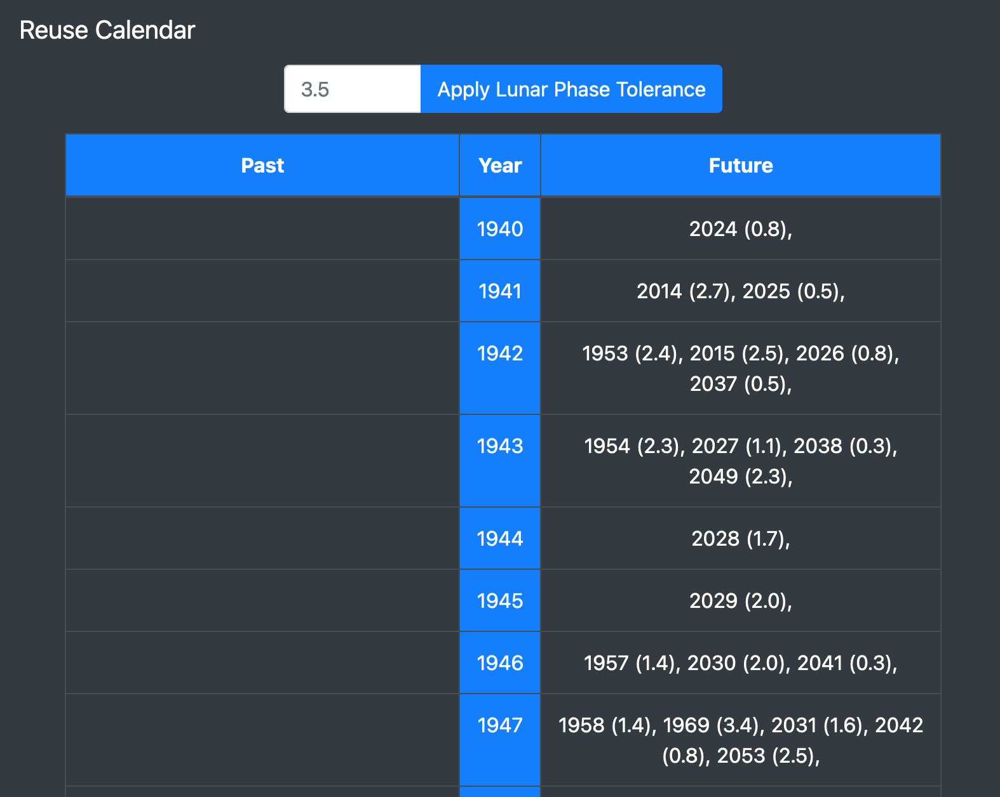

# ReuseCalendar
A Flask app to answer the question "When can I reuse these old calendars I have laying around?".
For calendar re-users who care about lunar phase alignment.

# Additional Details
- All matches ensure same numbers of days in each year (leap vs non-leap years)
- All matches ensure that the years both start on the same day of the week
- Can filter results on how close the lunar phases sync up between years.
  - Decent tolerance for casual observers might be ~3.5 days.
  - Can expand range to 15+ days to view all matches regardless of lunar phase sync

# Example:

